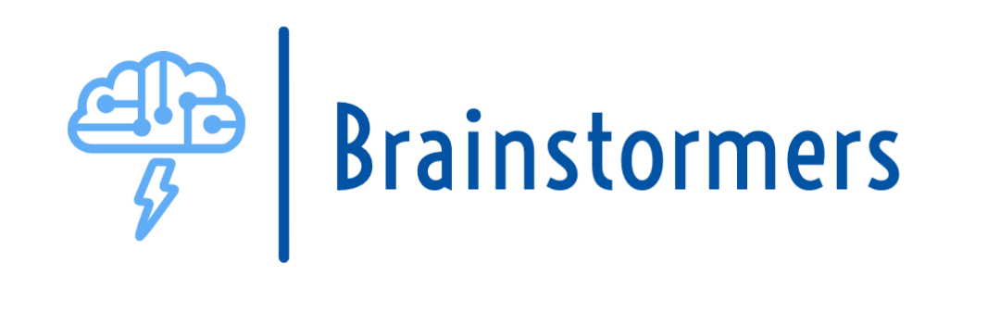

# Brainstormers 


## Description

This project is my capstone project at Flatiron School, Software Engineering program. 
Brainstormers is an application that provides tools used for studying and learning by creating/studying studysets and flashcards. 

## Installing / Executing the Program
### To start the frontend

cd client
```
npm install --prefix client
npm start --prefix client
```
### To start the backend 
cd ..
```
bundle install
rails s
```

## Built With
- JavaScript
- Ruby on Rails
- React 
- React Redux
- Semantic Ui, Material Ui
- Quill js

## Links
- [Heroku Brainstormers](https://yi-brainstormers.herokuapp.com/)
- [Repo](https://github.com/leslieyi/brainstormers)

## Screenshots
### Homepage


### Studysets


### Testing Mode


## Author
**Leslie Yi**
- [Profile](https://github.com/leslieyi "Leslie Yi")
- [Email](mailto:leslieyi411@gmail.com)
- [Blog](https://leslieyi.medium.com/)

## Support 
Contributions, issues, and feature requests are welcome!
Give a ⭐️ if you like this project!


